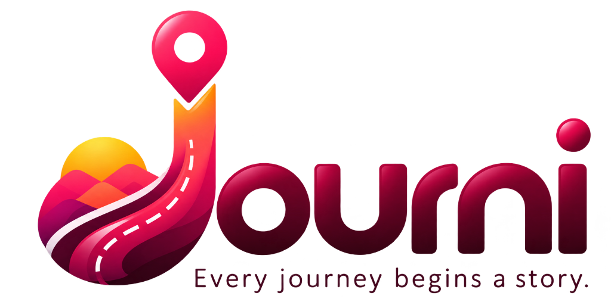

# 🌍 Journi — Every journey begins a story.

<p align="center">
  

**AI-Powered Travel Planner built with Next.js 15, TypeScript & Tailwind CSS**

</p>

Journi is a modern AI-first travel planning application that transforms a simple travel prompt into a complete personalized travel experience.

Instead of visiting multiple websites for destinations, itineraries, weather, budgets, maps, and travel ideas, users simply describe their trip in natural language. Journi intelligently creates a beautiful day-by-day travel plan that users can customize, save, and revisit anytime.

> **Journi is built around one idea:** Planning a journey should be as easy as describing a dream.

---

## ✨ Why Journi?

Journi combines the simplicity of AI conversation with the organization of a premium travel planner.

**Example prompts**

> *Plan a honeymoon in Maldives for 5 days under ₹40,000.*

> *Suggest a family trip to Munnar for 3 days in December.*

> *Solo backpacking trip from Bangalore under ₹12,000.*

Journi understands the prompt and generates a complete travel plan within seconds.

---

# 🚀 Version 1 Features (MVP)

### 🤖 AI Trip Planner

Create complete trips using natural language prompts.

### 🗓️ Smart Day-wise Itinerary

Morning, afternoon, evening and night travel schedule for every day.

### 💰 Budget Planner

Track estimated expenses across accommodation, food, transport, activities and shopping.

### 🎒 AI Packing Checklist

Automatically generate packing items based on destination, weather and trip type.

### 🌤️ Weather Forecast

Current weather, hourly forecast, sunrise/sunset and travel weather summary.

### 🗺️ Map Explorer

View attractions, restaurants, cafes and recommended hotels on an interactive map.

### ❤️ Saved Places

Create your personal destination wishlist.

### 🧳 Trip Dashboard

Manage all upcoming, ongoing and completed trips.

### 👤 Profile & Travel Preferences

Save travel style, preferred budget, language and other preferences.

### ♿ Accessibility-First Experience

Keyboard navigation, screen reader support, high contrast UI and reduced motion support.

---

# 📱 Mobile Experience (18 Screens)

| Screen | Purpose                 |
| ------ | ----------------------- |
| M01    | Splash Screen           |
| M02    | Discover Amazing Places |
| M03    | Plan Your Trip with AI  |
| M04    | Save Every Journey      |
| M05    | Login                   |
| M06    | Register                |
| M07    | AI Home                 |
| M08    | AI Planning Result      |
| M09    | Trip Dashboard          |
| M10    | Trip Details            |
| M11    | Day-wise Itinerary      |
| M12    | Budget Planner          |
| M13    | Packing Checklist       |
| M14    | Weather                 |
| M15    | Map Explorer            |
| M16    | Saved Places            |
| M17    | Profile                 |
| M18    | Settings                |

---

# 💻 Desktop Experience (12 Pages)

| Page | Purpose               |
| ---- | --------------------- |
| D01  | Landing Page          |
| D02  | How Journi Works      |
| D03  | AI Planner            |
| D04  | Destinations Explorer |
| D05  | Login / Register      |
| D06  | AI Planning Result    |
| D07  | Trip Dashboard        |
| D08  | Trip Details          |
| D09  | Itinerary Planner     |
| D10  | Budget Planner        |
| D11  | Map Explorer          |
| D12  | Profile & Settings    |

Desktop layouts are designed specifically for large screens and are **not stretched mobile layouts**.

---

# 🎨 Design Philosophy

Journi follows a premium startup design language inspired by:

* Apple Human Interface Guidelines
* Airbnb Design Language
* Google Travel
* Vercel Web Interface Guidelines

### Brand Personality

* Premium
* Emotional
* Calm
* Modern
* Friendly
* Storytelling-driven

### Official Brand Colors

* Burgundy `#5B0B24`
* Journey Pink `#C2185B`
* Coral Pink `#FF4F7A`
* Sunset Orange `#FF7A3D`
* Golden Yellow `#FFC83D`
* Soft White `#FFF7FA`

Everything is designed around the official Journi logo.

---

# ⚡ Performance First

Journi is designed for speed.

### Performance Goals

* Lighthouse Performance **95+**
* Accessibility **100**
* SEO **100**
* Best Practices **100**

### Optimizations

* Next.js Server Components
* Lazy Loading
* Dynamic Imports
* Code Splitting
* Skeleton Loading
* SVG Icons
* WebP / AVIF Images
* Font Optimization
* Minimal Client Components

---

# ♿ Accessibility First

Journi is built for everyone.

### Includes

* Keyboard Navigation
* Focus Indicators
* Screen Reader Friendly UI
* High Contrast Colors
* Reduced Motion Support
* Semantic HTML
* Large Touch Targets
* Text-to-Speech (Planned Placeholder)

Accessibility is a core design requirement, not an afterthought.

---

# 🔍 SEO First Architecture

Built using **Next.js App Router**.

Includes support for:

* Metadata API
* Open Graph
* Twitter Cards
* JSON-LD Structured Data
* Canonical URLs
* Sitemap
* Robots.txt
* Fast Search Indexing

---

# 🛠️ Tech Stack

| Frontend       | Backend            |
| -------------- | ------------------ |
| Next.js 15     | Node.js            |
| React 19       | Express APIs       |
| TypeScript     | MongoDB            |
| Tailwind CSS   | JWT Authentication |
| Framer Motion  | MongoDB Atlas      |
| Zustand        | AI Services        |
| TanStack Query | REST APIs          |
| Axios          | Cloud Storage (V2) |

---

# 📂 Project Structure

```text
app/
components/
features/
hooks/
lib/
services/
store/
constants/
types/
assets/
public/
```

The project follows a scalable feature-based architecture using **Next.js App Router**.

---

# 🗺️ Product Roadmap

## ✅ Version 1 — AI Travel Planner

* AI Prompt Planner
* Trip Dashboard
* Trip Details
* Itinerary Planner
* Budget Planner
* Packing Checklist
* Weather Forecast
* Map Explorer
* Saved Places
* Profile & Settings

**Version 1 intentionally excludes booking and payment features.**

---

## 🚀 Version 2 — Smarter Travel Experience

### 🤝 Collaborative Trip Planning

Invite friends or family to edit the same itinerary together.

### 💸 Expense Sharing

Split trip expenses between travellers.

### ✈️ AI Itinerary Editing

Ask AI to modify existing travel plans without starting over.

### 📶 Offline Itinerary

Access your travel plan even without internet.

### 📖 Journi Memories ⭐

**Relive every journey, anytime.**

Journi Memories is a private travel memory journal built into every trip.

#### Features

* 📸 Upload photos during active trips or after completing a trip.
* 🗂️ Organize memories day by day.
* 📝 Add captions, notes and locations to each memory.
* ❤️ Mark favorite memories.
* 🕒 Beautiful timeline view of your journey.
* 🔍 Search memories by destination or trip.
* ☁️ Secure cloud storage inside your Journi account.

> **Journi Memories is completely private. It is not a social media feed.** It exists so users can revisit their favorite journeys anytime without depending on another gallery or device.

### 📔 Travel Journal

Write personal notes and memories alongside photos.

---

## 🌎 Version 3 — Complete Travel Ecosystem

* Hotel Booking
* Flight Booking
* Bus Booking
* Train Booking
* Payment Gateway
* Live Pricing APIs
* AI Voice Travel Assistant
* Smart Travel Notifications

---

# 🚫 What Journi Version 1 Does NOT Include

To keep the MVP focused, Version 1 intentionally excludes:

* Hotel Booking
* Flight Booking
* Bus Booking
* Train Booking
* Payment Gateway
* Wallet
* Coupons
* Booking Confirmation
* Reviews & Ratings
* Admin Dashboard
* Vendor Dashboard
* Travel Marketplace
* Social Media Feed
* Travel Buddy Matching
* Live Booking APIs

Journi focuses on **planning first, booking later**.

---

# 🚀 Getting Started

```bash
git clone https://github.com/Praveen-VS/Journi_App.git

cd Journi_App

npm install

npm run dev
```

Visit **http://localhost:3000**

---

# 👨‍💻 About This Project

Journi is a startup-style portfolio project created to demonstrate production-ready frontend and full-stack development using modern React and Next.js architecture.

The project emphasizes:

* AI-first product design
* Scalable architecture
* Performance optimization
* Accessibility
* Responsive design
* SEO best practices
* Modern UI/UX engineering

It is being built from scratch using **Next.js 15, TypeScript, Tailwind CSS, MongoDB, Node.js, and AI-assisted development with Antigravity IDE**.

---

<p align="center">
  <h3 align="center">Journi — Every journey begins a story.</h3>

Plan smarter. Travel better. Relive forever.

</p>
